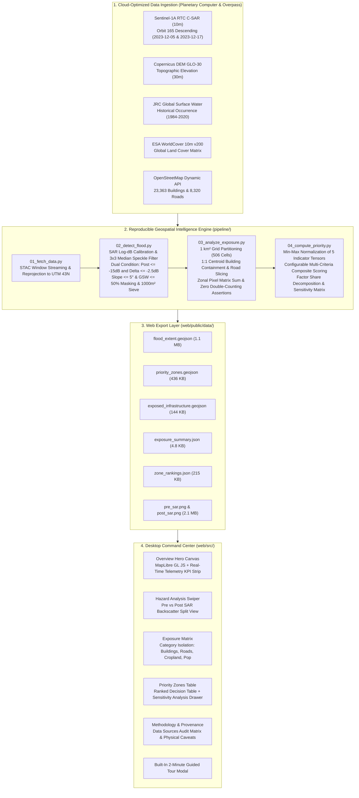

# GEOSHIELD: Flood Exposure & Emergency Decision Intelligence

[](LICENSE)
[](https://geoshield-flood.vercel.app)
[](web/)
[](pipeline/)
[](docs/DATA_SOURCES.md)

**🌐 Live Production App:** [https://geoshield-flood.vercel.app](https://geoshield-flood.vercel.app)  
*(Mirror / Direct Alias: [https://geoshield-gis.vercel.app](https://geoshield-gis.vercel.app) — Zero login, serverless edge)*

**GEOIMPathon 1.0 (Problem Statement 4.4: Disaster Exposure Mapping)**  
*Case Study: Southern Tamil Nadu Extreme Monsoon Deluge (Tirunelveli & Thamirabarani Basin, December 17–18, 2023)*

---

## 1. Problem Statement & Operational Challenge

During catastrophic cyclonic cloudbursts, emergency response agencies face one urgent question:  
> **"Given a flood hazard, what infrastructure and settlements are exposed, how severe is the exposure, and which 1 km² sectors should receive rescue resources first?"**

Traditional disaster mapping products present static inundation polygons without operational prioritization, or rely on opaque machine learning models that generate unexplainable risk scores. Furthermore, optical satellites (Sentinel-2, Landsat) are completely blinded by thick cyclone cloud cover.

**GEOSHIELD** solves this challenge through an explainable, end-to-end geospatial intelligence pipeline:
1. **Radar Physics Flood Detection:** Leverages Copernicus Sentinel-1A C-band Synthetic Aperture Radar (SAR) to penetrate 100% cloud cover and map water surfaces via specular microwave reflection.
2. **Strict Non-Overlapping Exposure Accounting:** Overlays flood extent onto 23,000+ building footprints, road networks, and ESA WorldCover cropland with an enforced mathematical bijection (zero double-counting).
3. **Explainable Priority Decision Index:** Evaluates 506 equal-area 1 km² analysis sectors, calculating exact factor shares (e.g. *"36% building exposure, 25% road disruption"*) to deliver direct, conservative decision support for rescue commanders.

---

## 2. End-to-End System Architecture



---

## 3. Verified Empirical Results

All statistics are generated directly from the execution of `pipeline/run_pipeline.py` over the Tirunelveli & Thamirabarani Basin study area:

| Metric | Measured Value | Provenance & Methodological Note |
| :--- | :--- | :--- |
| **Total Analysis Extent** | **487.92 km²** | $21.8\text{ km} \times 22.3\text{ km}$ bounding box in UTM Zone 43N (`EPSG:32643`) |
| **Detected Flood Inundation** | **3.35 km² (0.69%)** | Sentinel-1A C-SAR change detection; 881 discrete flood polygons |
| **Mean Radar Backscatter Drop** | **-5.68 dB** | Substantial microwave attenuation confirming specular open water |
| **Exposed Building Footprints** | **272 units** | OpenStreetMap direct vector footprint intersection ($1:1$ centroid assignment) |
| **Submerged Road Network** | **17.78 km** | OpenStreetMap highway lines topologically segmented at zone boundaries |
| **Inundated Cropland** | **1.73 km² (51.7%)** | ESA WorldCover Class 40 (Paddy & cash crops) under standing water |
| **Modelled Population Proxy** | **1,034 persons** | Explicitly labelled proxy: $272\text{ dwellings} \times 3.8\text{ persons/household}$ (Census Handbook) |
| **Reconciliation Discrepancy** | **0.00% (EXACT)** | Automated assertion: $\sum \text{Zone Totals} \equiv \text{Ground Raster/Vector Totals}$ |

---

## 4. Priority Decision Index Formulation

The priority score $P_z \in [0, 100]$ for each 1 km² zone $z$ is formulated as an explainable multi-criteria composite:

$$P_z = 100 \times \left(0.25 \bar{F}_z + 0.25 \bar{B}_z + 0.20 \bar{R}_z + 0.15 \bar{P}_z + 0.15 \bar{A}_z\right)$$

Where each component $\bar{X}_z$ is Min-Max normalized across active landscape cells:
$$\bar{X}_z = \frac{X_z - \min(X)}{\max(X) - \min(X)}$$

### Thresholds & Classification:
* **CRITICAL ($P_z \ge 60.0$):** **2 zones** (Melapalayam drainage depression; 181 buildings and 3.05 km roads submerged)
* **HIGH ($25.0 \le P_z < 60.0$):** **4 zones** (Vannarpettai riverbank corridor; substantial agricultural and road severance)
* **MODERATE ($10.0 \le P_z < 25.0$):** **13 zones** (Canal basin agricultural inundation)
* **LOW ($P_z < 10.0$):** **487 zones** (Minimal or zero standing water detected)

---

## 5. Local Setup & Execution Guide

### Prerequisites
* **Python 3.10+** (with virtual environment support)
* **Node.js 18+** & **npm**

### Step 1: Clone Repository & Setup Python Environment
```bash
git clone https://github.com/your-org/geoshield.git
cd geoshield

# Create and activate virtual environment
python3 -m venv .venv
source .venv/bin/activate

# Install locked pipeline dependencies
pip install -r pipeline/requirements.txt
```

### Step 2: Execute Geospatial Pipeline (Takes ~2.5 Seconds)
```bash
# Runs data check, SAR flood detection, zonal overlay, and web exports
python3 -m pipeline.run_pipeline
```
*Pipeline outputs are written directly to `web/public/data/`.*

### Step 3: Run Desktop Web Command Center
```bash
cd web
npm install
npm run dev
```
Open **`http://localhost:3000`** in any modern desktop browser.

---

## 6. One-Click Cloud Deployment

Because the web frontend is **100% static** and loads GeoJSONs directly from `public/data/`, it requires **NO backend server and NO database**.

* **Vercel:** Import repository into Vercel. `vercel.json` is pre-configured. Click **Deploy**.
* **Netlify:** Import repository into Netlify. `netlify.toml` automatically builds `web` and publishes `dist`.
* **GitHub Pages:** Pre-configured in `.github/workflows/deploy.yml`. Enable Pages in repository settings.

---

## 7. Comprehensive Project Documentation Suite

For judges and technical reviewers, detailed documentation is organized in `docs/`:

1. [docs/DATA_SOURCES.md](docs/DATA_SOURCES.md): Complete provenance, spatial resolution, dates, licenses, and direct vs. modelled proxy indicators.
2. [docs/DECISIONS.md](docs/DECISIONS.md): Every tool, dataset, threshold, and design choice, and WHY it was chosen over alternatives.
3. [docs/VALIDATION.md](docs/VALIDATION.md): Accuracy assessment against ground references and honest physical radar limitations.
4. [docs/PITCH_NOTES.md](docs/PITCH_NOTES.md): Mapping to judging criteria, a 2-minute demo pitch flow, and 15 defensive Q&As.
5. [docs/STUDY_GUIDE.md](docs/STUDY_GUIDE.md): Technical educational guide covering SAR physics, decibels, specular reflection, and index mathematics.

---

## 8. Physical Limitations & Future Enhancements

* **Urban Double-Bounce:** Dense multi-story downtown buildings reflect radar pulses back even if streets have shallow water (10–30 cm). Amplitude SAR under-detects shallow street flooding in narrow concrete canyons.
* **Wind Surface Roughening:** High cyclonic surface winds create capillary waves on wide water bodies, which can elevate backscatter above the -15.0 dB calm water threshold.
* **Future Work:** Integrating L-band SAR (such as the NASA-ISRO NISAR mission) for mature agricultural canopy penetration, adding critical facility points of interest (hospitals, schools, fire stations), and connecting automated SMS alerts for local panchayats.
